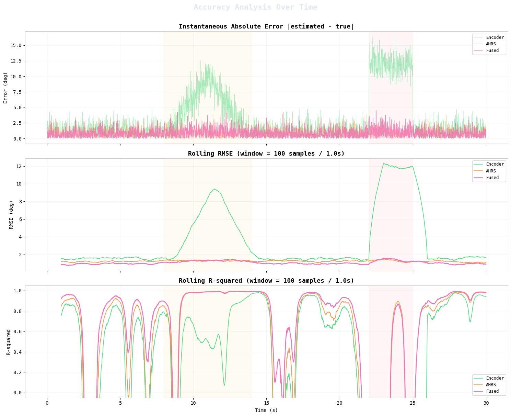

# 🛰️ COTP Antenna Pointing System: 3D Kinematics & Confidence-Weighted Sensor Fusion

[](https://www.python.org/)
[](https://riverbankcomputing.com/software/pyqt/)
[](https://docs.pyvista.org/)
[]()

A high-fidelity simulation environment and real-time sensor fusion pipeline for a **3-Axis COTP (Communication On-The-Move) Antenna Pointing System** (Azimuth, Elevation, Polarization).

This project integrates real CAD STL kinematic meshes, dynamic motor plant dynamics with mechanical stall/friction, dual sensor modeling with real-time fault injection (mechanical drift and electrical glitches), and a **causal confidence-score unit quaternion sensor fusion algorithm** that completely eliminates sensor divergence without gimbal lock.

---

## 📸 Simulation & Error Analysis Preview

### Accuracy Analysis Under Dynamic Fault Injection
Below is the evaluation of tracking performance under mechanical drift ramp (orange zone, $t=8\text{s} - 14\text{s}$) and electrical glitch step offset (pink zone, $t=22\text{s} - 25\text{s}$):



*Key Takeaways:*
* **Encoder (Orange/Green)** suffers from severe drift and offset divergence ($>12^\circ$ error).
* **AHRS (Sky Blue)** has higher baseline jitter but zero drift.
* **Fused Output (Emerald Green)** dynamically suppresses the degraded sensor in real time, maintaining sub-degree tracking accuracy and lowest Rolling RMSE.

---

## 🌟 Key Features

### 1. 🦾 3D Kinematics with Real CAD Assembly
* **3-Axis Articulation**: Forward kinematics (FK) transformation matrices for:
  * **Azimuth**: $0^\circ \to 360^\circ$ continuous rotation about $[0, 0, 1]^T$.
  * **Elevation**: $0^\circ \to 90^\circ$ rotation about $[1, 0, 0]^T$ at offset pivot $[0, 0, 95]\,\text{mm}$.
  * **Polarization**: $0^\circ \to 180^\circ$ rotation about $[0, 0, 1]^T$ at offset pivot $[0, 135, 170]\,\text{mm}$.
* **Interactive 3D Viewport**: Built on `PyVista` and `VTK` via `QtInteractor`, featuring degree overlays, coordinate axes, and camera controls.

### 2. 🎯 Dual Motion & Plant Models
* **Cascade PID Target Chasing**:
  * **Outer Loop**: Position error $e_{pos} = \theta_{target} - \hat{\theta}_{fused} \implies v_{demand}$.
  * **Inner Loop**: Velocity rate error $e_{roc} = |v_{demand}| - |\hat{\omega}_{fused}| \implies \text{PWM}$.
  * **Motor Dynamics**: Friction model (static + velocity-proportional) and dynamic load factors scaling with elevation angle:
    $$lf_{az} = \max(0.75, 1 - 0.15\sin\theta_{el})$$
    $$lf_{el} = \max(0.30, \cos\theta_{el})$$
    $$lf_{pol} = \max(0.65, 1 - 0.22\sin\theta_{el})$$
  * **Stall Detection & Boost**: Automatic windowed stall monitoring with decaying impulse boost ($\alpha = 0.87$).
* **Brownian Motion Trajectory Generator**:
  * Wiener process angular velocity with damping ($\alpha = 0.998$) and reflective mechanical boundaries at physical limits:
    $$\omega(t + \Delta t) = \alpha\,\omega(t) + \sigma_{BM}\sqrt{\Delta t}\,\mathcal{N}(0, 1)$$

### 3. ⚡ Multi-Sensor Modeling & Fault Injection
* **Optical Encoder**: High precision, low base noise ($\sigma_{enc}$), susceptible to:
  * *Mechanical Drift*: Continuous linear error ramp simulating slip or calibration loss.
  * *Electrical Glitch*: Instantaneous step offset simulating bit-flips or bus dropouts.
* **AHRS (Attitude & Heading Reference System)**: Higher baseline Gaussian noise ($\sigma_{ahrs}$), zero long-term drift.

### 4. 🧮 Causal Confidence-Weighted Quaternion Fusion
Instead of rigid constant-covariance Kalman filtering, the system dynamically calculates sensor credibility:
1. **Rolling Detrended Variance** ($\sigma_i^2$): Computed over a 50-sample ($0.5\,\text{s}$) sliding window to isolate measurement noise from intentional antenna movement.
2. **Residual Consensus Error** ($\epsilon_i$): Measures divergence from the consensus trend:
   $$\epsilon_i = |\theta_i - \bar{\theta}|$$
3. **Dynamic Confidence Score** ($c_i \in (0, 1]$):
   $$c_i = \frac{1}{1 + \sigma_i^2 + \epsilon_i}$$
4. **Unit Quaternion Representation & Normalization**:
   Converts 1D angles to 3D unit quaternions $\mathbf{q}_i = [\cos(\theta_i/2), \sin(\theta_i/2), 0, 0]^T$ to prevent gimbal singularities:
   $$\mathbf{q}_{fused} = \frac{\sum_{i=1}^n c_i \mathbf{q}_i}{\left\|\sum_{i=1}^n c_i \mathbf{q}_i\right\|}$$

### 5. 🖥️ Unified 2-Page PyQt5 Desktop Suite
* **Page 1 — Live 3D Simulation & Control**:
  * Live 3D PyVista CAD assembly rendering.
  * Real-time sliders for sensor noise ($\sigma_{enc}, \sigma_{ahrs}$) and interactive fault trigger buttons (Drift Ramp, Glitch Offset).
  * Real-time synchronized PyQtGraph telemetry curves (True, Encoder, AHRS, Fused, Target, Error, and Confidence Weights).
  * Real-time CSV flight recorder.
* **Page 2 — Post-Run Analysis & Data Inspector**:
  * Instant 1-click loading of recorded simulation runs or external CSV files.
  * Multi-axis switching (Azimuth, Elevation, Polarization).
  * Overview timeline strip with draggable / resizable ROI time window.
  * Live vertical crosshair HUD tracking mouse position with exact numeric values.
  * Comprehensive performance scorecard (RMSE, MAE, Max Error, SNR, and % Accuracy Improvement over raw sensors).

---

## 📁 Repository Structure

```plaintext
.
├── antenna_fusion/               # Python package
│   ├── core.py                   # Simulation engine: FK kinematics, PID plant, sensors, quaternion fusion
│   ├── simulator_app.py          # Flagship 2-page 3D simulation & post-run inspector app
│   ├── log_viewer.py             # Standalone interactive PyQt5 CSV time-series viewer
│   ├── csv_export.py             # Time-series CSV exporter used by the notebook
│   └── paths.py                  # Repository-relative asset / log locations
│
├── assets/
│   ├── cad/                      # STL meshes: azimuth_body, elevation_body, polarization_body
│   └── img/                      # App icon and Palatine wordmark
│
├── notebooks/
│   └── fusion_development.ipynb  # R&D notebook (algorithm design & validation)
│
├── data/
│   └── sample_timeseries.csv     # Sample single-axis fusion run for the log viewer
│
├── docs/
│   ├── kinematics.md             # Motor plant, friction, and kinematics equations
│   ├── confidence.md             # Mathematical derivation of confidence-weighted fusion
│   ├── development.md            # Step-by-step pipeline walkthrough
│   ├── design_system.md          # Palatine UI design system
│   ├── code_analysis.md          # Technical review of the notebook & core engine
│   └── images/                   # README / docs figures
│
├── logs/                         # Recorded simulation CSVs (created at runtime, gitignored)
│
├── run_simulator.bat             # 1-click Windows launcher for the 3D simulation
├── run_log_viewer.bat            # 1-click Windows launcher for the CSV viewer
├── requirements.txt              # Python package dependencies
└── .gitignore
```

---

## 🚀 Getting Started

### Prerequisites
* Windows 10/11 (or Linux/macOS with OpenGL/X11 support)
* Python 3.10 to 3.13

### 1. Installation
Clone the repository and install dependencies:

```bash
git clone https://github.com/Astro-Reza/Confidence_Demo.git
cd Confidence_Demo

# Optional: create a virtual environment
python -m venv venv
venv\Scripts\activate

# Install required packages
pip install -r requirements.txt
```

### 2. Launching the Applications

#### Option A: 1-Click Batch Launchers (Windows)
* Double-click **`run_simulator.bat`** to start the full 3D simulation suite.
* Double-click **`run_log_viewer.bat`** to start the standalone CSV inspector.

#### Option B: Terminal Commands
```bash
# Run from the repository root
# Launch the main 2-Page 3D Simulation Application
python -m antenna_fusion            # same as: python -m antenna_fusion.simulator_app

# Launch the standalone CSV Viewer (optionally pass a CSV file path)
python -m antenna_fusion.log_viewer
# or
python -m antenna_fusion.log_viewer data/sample_timeseries.csv
```

#### Option C: Explore the Development Notebook
```bash
jupyter notebook notebooks/fusion_development.ipynb
```

---

## 🎮 How to Use the Simulation

### Live Simulation Page
1. **Motion Mode**: Select **Target Chasing** (PID motor control tracking a user slider target) or **Brownian Motion** (stochastic physical wandering).
2. **Noise Sliders**: Adjust $\sigma_{enc}$ and $\sigma_{ahrs}$ in real time to observe filter adaptability.
3. **Fault Injection**:
   * Click **Inject Drift**: Forces a ramp offset on the encoder. Watch the encoder confidence plunge to near-zero as the filter shifts trust to the AHRS.
   * Click **Inject Glitch**: Injects an abrupt $+15^\circ$ jump. Notice the quaternion fusion completely ignores the glitch.
4. **Recording**: Click **Start Recording** to log all multi-axis telemetry to a timestamped CSV in `logs/`.

### Post-Run Analysis Page
1. Open the **Analysis & Inspector** tab.
2. Select a recorded session or open any external `.csv` log.
3. Drag the semi-transparent region on the bottom overview timeline to zoom into specific drift/glitch events.
4. Check the **Summary Score Card** to evaluate RMSE reduction and percentage accuracy improvements.

---

## 📐 Mathematical Formulation Summary

| Metric | Formula | Description |
| :--- | :--- | :--- |
| **Rolling Variance** | $\sigma_i^2 = \text{Var}(\theta_{i, t-W:t} - \hat{\theta}_{trend})$ | Measures high-frequency sensor noise over window $W=50$ samples |
| **Residual Error** | $\epsilon_i = \|\theta_i - \bar{\theta}_{consensus}\|$ | Disagreement between individual sensor and the ensemble mean |
| **Confidence Score** | $c_i = \frac{1}{1 + \sigma_i^2 + \epsilon_i}$ | Normalizes sensor credibility in range $[0, 1]$ |
| **Unit Quaternion** | $\mathbf{q}_i = [\cos(\theta_i / 2), \sin(\theta_i / 2), 0, 0]^T$ | Singularity-free 3D spatial rotation representation |
| **Fused Quaternion** | $\mathbf{q}_{fused} = \frac{\sum c_i \mathbf{q}_i}{\|\sum c_i \mathbf{q}_i\|}$ | Normalized confidence-weighted spherical sum |

---

## 🛠️ Tech Stack
* **Language**: Python 3.10+
* **GUI Framework**: PyQt5
* **Plotting & Telemetry**: PyQtGraph (60 FPS hardware-accelerated rendering)
* **3D Kinematics**: PyVista, PyVistaQt, VTK
* **Math & Scientific**: NumPy, SciPy (Spatial Rotation), Pandas

---

## 📄 License
Developed for COTP antenna tracking research and sensor fusion demonstration.
